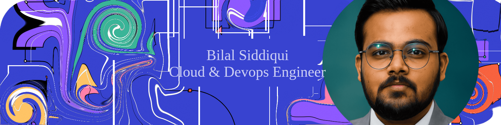

<div align="center">
  <h1>Bilal Siddiqui</h1>
  <p><strong>Senior DevOps Engineer · Cloud · Automation · Kubernetes · AI Tooling</strong></p>
  
</div>

<p align="center">
  I build reliable platforms, automate delivery, and explore practical ways to bring AI into developer workflows.
</p>

<p align="center">
  <a href="https://linkedin.com/in/muhammad-bilal-siddiqui-1551391b8"></a>
  <a href="https://stackoverflow.com/users/20290278"></a>
</p>

## About Me

| Focus | What I work on |
| --- | --- |
| Cloud platforms | Scalable AWS and Azure infrastructure, networking, and platform operations |
| Delivery automation | CI/CD pipelines, GitOps, release workflows, and Infrastructure as Code |
| Containers | Docker, Kubernetes, Helm, and production-ready workload operations |
| Engineering enablement | Observability, developer experience, technical writing, and open source |

## Skills & Tools

### Cloud, Platform & Automation


### Development & Observability


### AI Engineering Toolkit


I am especially interested in local models, model-assisted DevOps, retrieval pipelines, agentic workflows, and connecting developer tools through MCP.

## Current Focus

```text
Reliable platforms  |  Developer experience  |  AI-assisted operations
Cloud cost awareness |  Secure automation    |  Useful open source
```

## GitHub Activity

<div align="center">
  
  
</div>

<div align="center">
  
</div>

## Connect

<p>
  Open to thoughtful conversations about DevOps, cloud platforms, automation, and practical AI engineering.
  <br>
  <a href="https://linkedin.com/in/muhammad-bilal-siddiqui-1551391b8">LinkedIn</a> ·
  <a href="https://stackoverflow.com/users/20290278">Stack Overflow</a> ·
  <a href="https://instagram.com/bilalsiddiqui0111">Instagram</a>
</p>
